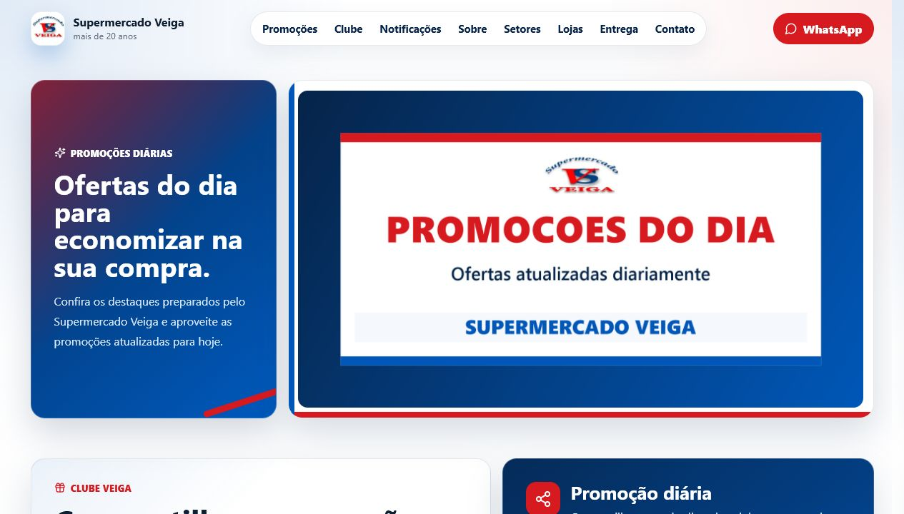

# Mercado Veiga

Aplicação web full stack criada para apresentar o Supermercado Veiga, divulgar
promoções e aproximar a loja de seus clientes. O projeto combina uma interface
responsiva em React com uma API em Node.js e Express.



## Sobre o projeto

O Mercado Veiga foi desenvolvido como um projeto de estudo com foco em uma
experiência digital simples para um supermercado local. A aplicação reúne
informações das lojas, setores, entregas e canais de atendimento, além de
recursos interativos para fidelização de clientes.

## Funcionalidades

- Promoção diária atualizada por imagem.
- Clube Veiga com cadastro por nome e telefone.
- Progresso de compartilhamentos e liberação de cupom.
- Compartilhamento nativo da promoção pela Web Share API.
- Preferências e testes de notificações do navegador.
- Service Worker para interação com notificações.
- Formulário de contato integrado ao WhatsApp.
- Página responsiva para computadores, tablets e celulares.
- API REST para cadastro, compartilhamentos e contatos.

## Tecnologias

**Frontend**

- React 19
- Vite 7
- JavaScript
- CSS responsivo
- Lucide React
- Web Notifications API
- Web Share API
- Service Worker

**Backend**

- Node.js
- Express
- API REST
- CORS

## Como executar

### Requisitos

- Node.js 20 ou superior
- npm

### Instalação

```bash
git clone https://github.com/furtadomarcos/Site-de-apresenta-o-para-Loja.git
cd Site-de-apresenta-o-para-Loja
npm install
npm run dev
```

O frontend ficará disponível em `http://localhost:5173` e a API em
`http://localhost:3333`.

No PowerShell, caso a política de scripts bloqueie o comando `npm`, utilize
`npm.cmd`:

```powershell
npm.cmd install
npm.cmd run dev
```

### Iniciador no Windows

Para iniciar somente a API em uma maquina Windows, execute:

```powershell
.\INICIAR_PAGINA.bat
```

O arquivo instala as dependencias se necessario e inicia a API em
`http://localhost:3333`. Para acessar de outro computador na mesma rede, use
um dos enderecos IP mostrados na janela e libere a porta `3333` no firewall, se
necessario.

## Variáveis de ambiente

O frontend usa `http://localhost:3333` como endereço padrão da API. Para usar
outro endereço, crie um arquivo `.env`:

```env
VITE_API_URL=https://sua-api.exemplo.com
```

## Endpoints principais

| Método | Endpoint | Descrição |
| --- | --- | --- |
| `GET` | `/api/health` | Verifica o estado da API |
| `POST` | `/api/club/login` | Cadastra ou atualiza um membro |
| `GET` | `/api/club/members/:memberId` | Consulta um membro |
| `POST` | `/api/promo-shares` | Registra um compartilhamento |
| `POST` | `/api/whatsapp-leads` | Registra um contato |

## Estrutura

```text
.
|-- public/          # Imagens e Service Worker
|-- server/          # API em Express
|-- src/             # Componentes e estilos React
|-- docs/            # Imagens da documentação
|-- index.html
|-- package.json
`-- vite.config.js
```

## Limitações atuais

- Os dados do Clube Veiga ficam em memória e são apagados ao reiniciar a API.
- O número do WhatsApp deve ser substituído pelo número oficial da loja.
- As notificações atuais são demonstrativas e dependem da permissão do
  navegador.
- O projeto ainda não está publicado em um servidor.

## Próximas melhorias

- Persistir clientes e cupons em banco de dados.
- Criar um painel administrativo para cadastrar promoções.
- Implementar autenticação e regras contra abuso de cupons.
- Publicar frontend e API.
- Adicionar testes automatizados.

## Autor

Desenvolvido por [Marcos Furtado](https://github.com/furtadomarcos).
